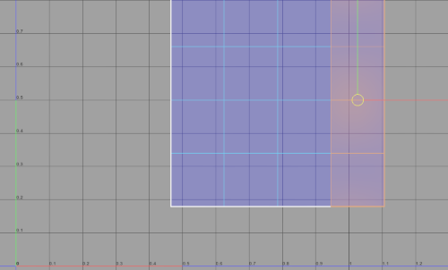
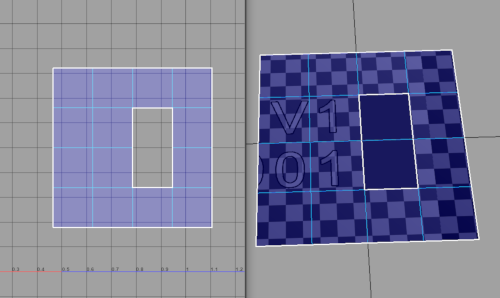
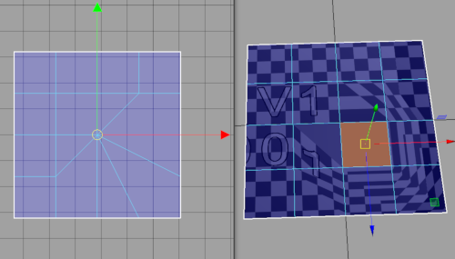
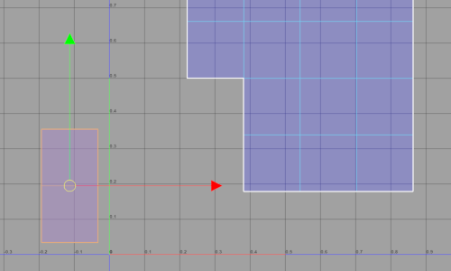
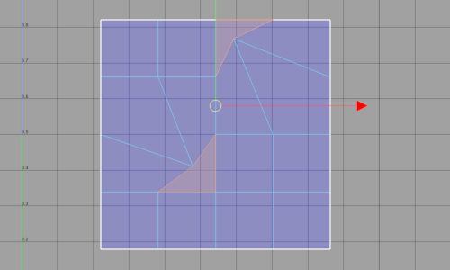

# UVChecker
Find general uv errors

## Check Numbers

### 0. Udim border intersections



### 1. Unmapped polygon faces



### 2. Zero-area UV faces



### 3. Unassigned UVs


### 4. UVs in negative space



### 5. Concave UV faces




## Flags
| Longname | Shortname | Argument types | Default | Properties | Description |
|:---------|----------:|:--------------:|:-------:|:----------:|:-----------:|
|check|c|integer||C||
|uvArea|uva|double|0.000001|C||
|uvSet|us|string|current uv set|C|Set what uv set you want to us|
|maxUvBorderDistance|muvd|double|0.0|C|Ignore UVs close to udims borders for "Udim border intersections" check|
|verbose|v|bool|False|C||


## Example
```python
from maya import cmds
errors = cmds.checkUV("|pSphere1", c=0)
print errors
>>> [u'|pSphere1|pSphereShape1.map[19]', u'|pSphere1|pSphereShape1.map[20]', ...]
```
